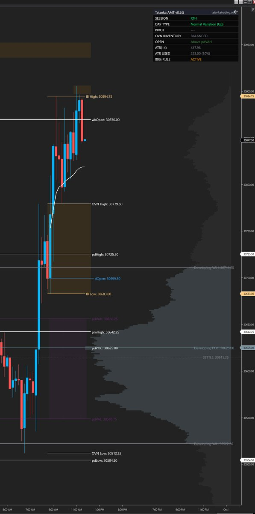

<p align="center"></p>

# Tatanka AMT Toolkit: NinjaTrader 8 Guide

Version 1.0.0 · [Tatanka Trading](https://tatankatrading.com) · Free and open source (MPL 2.0)

The Tatanka AMT Toolkit puts a complete Auction Market Theory read on one chart. This guide covers installing it, setting up the chart, loading levels, alerts and fixing common problems. For the TPO Profile, If/Then and 1hr 21 EMA, see the [other indicators guide](Other-Indicators-Guide.md).

<p align="center"></p>

## Contents

1. [Install](#1-install)
2. [Set up the chart](#2-set-up-the-chart)
3. [What you see on the chart](#3-what-you-see-on-the-chart)
4. [Daily levels](#4-daily-levels)
5. [Alerts](#5-alerts)
6. [Settings map](#6-settings-map)
7. [Updating](#7-updating)
8. [Troubleshooting](#troubleshooting)

## 1. Install

1. Download [TatankaAmtToolkit_NT8.zip](https://tatankatrading.com/nt/amt-toolkit). **Don't unzip it.**
2. In the NinjaTrader Control Center: **Tools → Import → NinjaScript Add-On**.
3. Pick the zip and confirm. NinjaTrader compiles it and says the import succeeded.
4. Open a chart, right-click → **Indicators**, double-click **Tatanka AMT Toolkit**, then **OK**.

The first load can take a while: the Toolkit loads 1-minute, 30-minute and daily history in the background. Until that's done the chart shows *"Tatanka AMT v1.0.0 — loading chart and secondary history…"*.

## 2. Set up the chart

| Setting | Value | Where |
| --- | --- | --- |
| Instrument | Any futures symbol (built for ES, NQ, CL, GC and their micros) | Chart → Data Series |
| Bars | Minute (for example 5 or 15 minute) | Data Series → Type / Value |
| Trading hours | ETH (the full Globex session) | Data Series → Trading hours |
| Days to load | 90 (400 if you use the yearly profile) | Data Series → Load data based on |
| Tick Replay | Off | Data Series |
| Merge policy | Merge back adjusted | Control Center → Tools → Options → Market Data |

Every session time in the Toolkit is CME exchange time (Central). Leave those inputs at their defaults even if you live in another time zone. The Toolkit shows a warning on the chart if one was changed (**1. Global Settings → Warn if Session Times Were Changed**).

Tip: once the chart looks right, save it as a template (right-click the chart → **Templates → Save As**) so a new ES or NQ chart opens with the same setup.

## 3. What you see on the chart

The Toolkit is organized around the questions an auction read asks every session.

**Where is value?**
- Developing volume profile for the session, week (default), month or year, with POC, VAH and VAL. Optional high-volume walls.
- Prior-day POC, VAH and VAL (RTH session) and prior-month POC, VAH, VAL, high and low.
- RTH VWAP from the 8:30 CT open (off by default).

**Balanced or trending?**
- Initial Balance (8:30–9:30 CT) with an optional midpoint.
- Day type, updated through the session: Trend Day, Normal Day, Normal Variation, Neutral Day (center or extreme) or Non-Trend Day. Before the auction develops: Gap Up, Gap Down or Developing.
- 80% Rule: when the session opens outside the prior day's value area, the value area is shaded; after price holds inside it for 60 minutes, it's marked confirmed.

**Who is trapped?**
- Overnight inventory versus the prior settlement. When the whole overnight session traded on one side of settlement, the settlement line is marked **TRAP ACTIVE** and the day type shows TRAP.
- Late spike: the base of a breakout in the last 30 minutes of RTH (14:30–15:00 CT).

**What is unfinished?**
- Naked POCs (daily, weekly, monthly), removed once price trades through them.
- Single prints from a 30-minute TPO profile of RTH, with tails filtered out.
- Poor highs and lows: a session extreme with two or more TPO periods at the same price.

**Which reference prices matter?**
- Overnight high and low (removed at 15:00 CT by default), previous day, week and month high and low, the weekly open (Sunday Globex) and the RTH open.

**Dashboard** (top right by default): session, day type, pivot bias (price versus your pasted pivot), overnight inventory, open location, daily ATR and ATR used, and 80% Rule status. The header shows **Tatanka AMT v1.0.0** and tatankatrading.com.

## 4. Daily levels

### Paste box

**2. Daily Levels → Paste Levels Here** takes one line:

```
2026-10-05, 7745.25, 7758.25, 7772.00, 7786.50, 7801.25, 7818.00, 7730.25, 7718.25, 7707.25, 7690.50, 7672.75
```

The date, the pivot, then any prices. Prices above the pivot are resistance (R1 nearest) and prices below it are support (S1 nearest), so their order after the pivot doesn't matter. The three-line block (`Pivot Level:` / `Resistance Levels:` / `Support Levels:`) also works. If both are pasted, the one-line version wins.

Copying a whole Discord message works too: titles, code fences and bold markers are skipped.

Each level gets a zone (sized by daily ATR or by ticks), flips color once price passes through it by the Flip ATR Buffer, and can alert.

Checks that protect you from pasting the wrong thing:

- **STALE LEVELS** shows when the line's date is older than the chart's trading date.
- Levels are rejected if the pivot is more than 20% from the chart's price (usually another symbol's line) or a price is more than 20% from the pivot (usually a thousands separator, such as `7,745.25`).
- A rejected paste draws no levels and the chart says why. A rejected levels file keeps the last good levels on the chart.

### Levels file (optional)

Instead of pasting, point **Levels File** at a text file containing the same line. The Toolkit re-reads it every few seconds, so a file that's replaced each morning updates the chart without reloading. `{root}` in the path becomes the chart's symbol, so one template works everywhere, and micros read their parent (MES reads ES, MNQ reads NQ, MCL reads CL, MGC reads GC). Example:

```
%USERPROFILE%\Documents\Tatanka\levels\{root}.txt
```

Leave **Levels File** blank to use the paste box.

### Daily ML levels

Tatanka Trading's daily ML levels for ES, NQ, CL and GC come in exactly this one-line format with the $20/month Patreon, together with the Globex levels after the close and the afternoon review plans. See [tatankatrading.com](https://tatankatrading.com).

## 5. Alerts

- Each section has its own alert switches (for example **6. Initial Balance → Alert IB High Cross**). Level alerts are under **2. Daily Levels → Enable Level Alerts**.
- **18. Alerts → Level Alert Mode:** *Cross*, *Zone Entry* or *Both*. Zone Entry fires when price enters the band around a level.
- **Enable Alert Sound / Sound File:** plays a sound from NinjaTrader's sounds folder.
- **Alert storm cap:** limits how many alerts fire in a rolling window (30 per 60 minutes by default).
- Alerts appear in NinjaTrader's **Alerts Log** window. Add the Toolkit with alerts on only one chart per instrument, or every alert fires twice.

### Phone alerts through Discord (optional)

1. In your own Discord server: **Server Settings → Integrations → Webhooks → New Webhook**, pick the channel, **Copy Webhook URL**.
2. In the Toolkit: **19. Discord Alerts → Send Chart Alerts to Discord** on, paste the URL into **Discord Webhook URL**.
3. Turn on Discord push notifications for that channel on your phone.

Only live alerts are sent; historical loading and Playback are skipped. If Discord is unreachable, NinjaTrader's own alerts still fire.

## 6. Settings map

| Group | What's in it |
| --- | --- |
| 1. Global Settings | Profile Row Scale, tick size, Force on Top, hide all labels, price-axis tags, session-time warning |
| 2. Daily Levels | Levels file, paste box, lines, zones, labels, level alerts |
| 3. Previous Day High/Low/Open | pdHigh, pdLow, pdOpen |
| 4. Previous Day Value & 80% Rule | pdPOC, pdVAH, pdVAL, 80% Rule fill and alerts |
| 5. Overnight High/Low | OVN session, removal time, alerts |
| 6. Initial Balance | IB period, midpoint, extension, alerts |
| 7. RTH VWAP | Start/end time, style, alert |
| 8. Daily & Weekly Open | RTH open, weekly open |
| 9. Previous Week | pwHigh, pwLow |
| 10. Previous Month | pmVAH, pmVAL, pmPOC, pmHigh, pmLow |
| 11. Volume Profile | Period, row size, value area %, look, alerts |
| 12. Volume Profile Walls | High-volume walls |
| 13. TPO & Single Prints | TPO period, single prints, poor highs/lows |
| 14. Naked POCs | Daily, weekly, monthly nPOCs |
| 15. Settlement & Inventory | Settlement line, trap logic |
| 16. Late Spike | Spike window and base |
| 17. Dashboard | Position, size, ATR period |
| 18. Alerts | Storm cap, Level Alert Mode, sound |
| 19. Discord Alerts (Optional) | Webhook for phone alerts |
| 20. NinjaTrader Limits | Maximum rows per profile/TPO, maximum retained structures |
| About | Version and website |

Every section follows the same order: on/off switches, lines, labels, then alerts.

**Profile Row Scale** (Global Settings) is set to *Auto*: it sizes profile rows, naked POC bins and single-print blocks to the symbol's price, so NQ gets larger rows than ES without a separate mode. Pick a fixed scale (1x–100x) if a symbol loads slowly.

## 7. Updating

NinjaTrader has no auto-update. When a new version is posted:

1. Compare the dashboard header (**Tatanka AMT v1.0.0**) with the [latest release](https://github.com/TatankaTrading/tatanka-indicators/releases/latest).
2. Download the new zip from the same link and import it the same way. Accept the overwrite.
3. Reload the chart (F5). Your saved settings are kept.

## Troubleshooting

| Problem | Fix |
| --- | --- |
| Import fails with compile errors | NinjaTrader compiles every script on your PC together, so a broken script elsewhere blocks the import. Open **New → NinjaScript Editor**; the error list names the file. Fix or remove that file, then import again. |
| Red text on the chart, or nothing drawn | Check the **Log** tab in the Control Center for the Toolkit's message. Quote the version number when asking for help. |
| "loading chart and secondary history…" never clears | Your data feed needs 1-minute and daily history for the symbol. Check the connection and Days to load. |
| STALE LEVELS warning | The pasted date is older than the chart's trading date. Paste today's line. |
| Levels rejected (20% message) | The line is for another symbol, or a price has a thousands separator. |
| Chart is slow on NQ or another big-range symbol | Set **Profile Row Scale** higher (for example 10x), or use a shorter profile period. |
| Older profiles or structures disappear | **20. NinjaTrader Limits** removes the oldest items first so the chart never crashes. Raise the limits if your PC can handle it. |
| Alerts fire twice | The Toolkit is on two charts of the same instrument with alerts on. Turn alerts off on one. |

## License

Open source under the [Mozilla Public License 2.0](../LICENSE). Copyright (c) 2026 Tatanka Trading LLC.

*Trading futures involves substantial risk of loss. The Toolkit is an analysis tool. It gives no buy/sell signals and no trade recommendations.*
