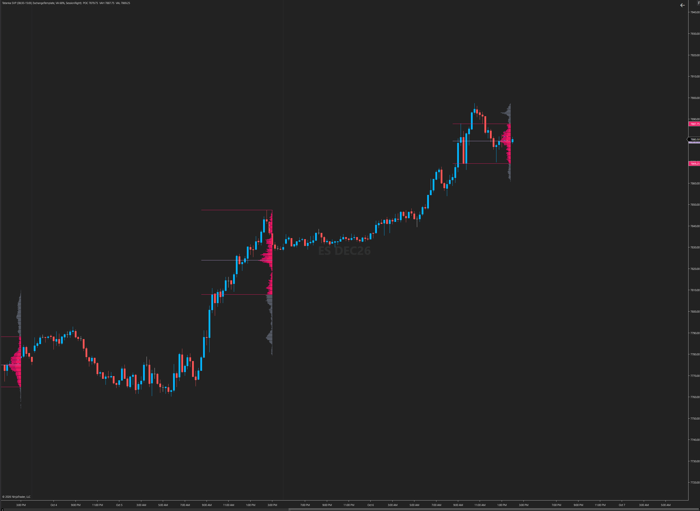
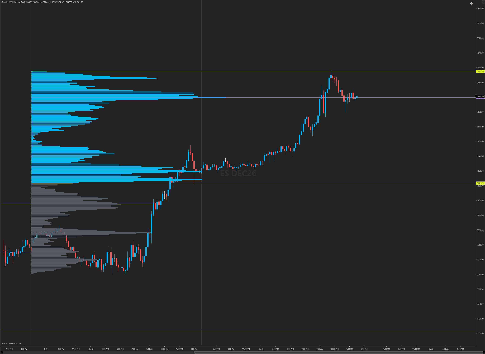
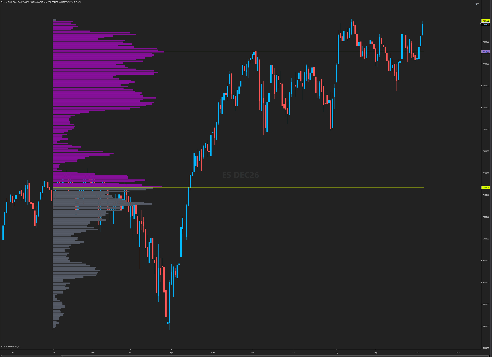

<p align="center"></p>

# TPO Profile, If/Then, 1hr 21 EMA, Level Lines and Volume Profiles: Guide

Version 1.0.0 · [Tatanka Trading](https://tatankatrading.com) · Free and open source (MPL 2.0)

Free indicators that sit beside the [Tatanka AMT Toolkit](NinjaTrader-Guide.md). TPO Profile, If/Then and 1hr 21 EMA are on NinjaTrader 8 and TradingView; Level Lines and the three volume profiles are NinjaTrader 8 only.

| Indicator | TradingView script | NinjaTrader download | NinjaTrader name |
| --- | --- | --- | --- |
| TPO Profile | [TPO Profile](https://tatankatrading.com/tv/tpo) | [TatankaTPO_NT8.zip](https://tatankatrading.com/nt/tpo) | TPO Profile |
| If/Then | [If/Then Bias Table](https://tatankatrading.com/tv/ifthen) | [TatankaIfThen_NT8.zip](https://tatankatrading.com/nt/ifthen) | If/Then Bias Table |
| 1hr 21 EMA | [HTF EMA (1H 21 by default)](https://tatankatrading.com/tv/21ema) | [Tatanka21EMA_NT8.zip](https://tatankatrading.com/nt/21ema) | HTF EMA (1H 21 by default) |
| Level Lines | NinjaTrader only | [TatankaLevelLines_NT8.zip](https://github.com/TatankaTrading/tatanka-indicators/releases/latest/download/TatankaLevelLines_NT8.zip) | Level Lines |
| [Session Volume Profile](#session-volume-profile) | NinjaTrader only | [TatankaSessionVolumeProfile_NT8.zip](https://github.com/TatankaTrading/tatanka-indicators/releases/latest/download/TatankaSessionVolumeProfile_NT8.zip) | TatankaSessionVolumeProfile |
| [Periodic Volume Profile](#periodic-volume-profile) | NinjaTrader only | [TatankaPeriodicVolumeProfile_NT8.zip](https://github.com/TatankaTrading/tatanka-indicators/releases/latest/download/TatankaPeriodicVolumeProfile_NT8.zip) | TatankaPeriodicVolumeProfile |
| [Auto Anchored Volume Profile](#auto-anchored-volume-profile) | NinjaTrader only | [TatankaAutoAnchoredVolumeProfile_NT8.zip](https://github.com/TatankaTrading/tatanka-indicators/releases/latest/download/TatankaAutoAnchoredVolumeProfile_NT8.zip) | TatankaAutoAnchoredVolumeProfile |

The AMT Toolkit, TPO Profile, If/Then and 1hr 21 EMA also come in one zip: [TatankaAll_NT8.zip](https://tatankatrading.com/nt/all). Level Lines and the volume profiles are separate downloads.

## Install

**TradingView:** open the script page, click **Add to favorites**, then on your chart open **Indicators → Favorites** and click the script.

**NinjaTrader 8:** download the zip (don't unzip it), then **Tools → Import → NinjaScript Add-On** and pick the zip. Add the indicator from the chart's **Indicators** window.

## TPO Profile

TPO (Market Profile) letters for each 30-minute period of the session, with the POC, the value area and a heatmap gradient from the open to the close. Recent days get full letter detail; older days get an outline.

Settings worth knowing:

- **Session Time / Filter by Time (RTH Only):** the session the profile is built from. On NinjaTrader this is in your **chart's time zone** (0830-1500 is RTH for Central time; use 0930-1600 for Eastern).
- **Block Size (Minutes):** 30 by default, one letter per block.
- **Auto Row Height / Target Rows Per Day:** sizes the rows from the daily ATR, so ES and NQ both look right without changing settings. Turn Auto off to set rows in ticks.
- **Days with Letter Detail / Max Polyline Days:** how many days get letters and how many get outlines. Lower them if the chart is slow.
- **Show Value Area, Extend POC Through Next RTH Session, Show Developing:** the value area lines, carrying the POC into the next session, and the live session's profile.

## If/Then

Turns the afternoon review's if/then plan into a live table on the chart. Each band is a price range with its bias and plan; the band price is in right now is highlighted, and a line is drawn at each band's bottom (LO).

Paste the review's block into **If/Then block → Rows** (NinjaTrader opens a multi-line editor), one band per line, top band first:

```
BIAS|LO|HI|TEXT
```

- **LO / HI:** the band's bottom and top. `0` means no bottom; `9999999` means no top.
- **TEXT:** the plan for that band. A literal `\n` (backslash, n) starts a new line in the box. Don't use `|` inside the text.
- **BIAS:** the letter the afternoon review uses for that band; it sets the band's color.

Settings worth knowing:

- **Line/label color:** *Bias* colors each line by its band's bias; *Position* colors it by where it sits versus price (above = resistance, below = support, within a daily-ATR band = neutral).
- **Plot ATR zones around lines / Zone ATR %:** shaded zones sized by daily ATR.
- **Table position, Text size, Show table:** where the table sits and whether it shows.

The afternoon review's if/then blocks come with the $20/month Patreon, along with the daily ML levels. See [tatankatrading.com](https://tatankatrading.com).

## 1hr 21 EMA

The 21-period EMA from the 1-hour chart, drawn on any chart timeframe. Change **Source timeframe** and **EMA length** for a different higher-timeframe EMA.

**Mode:**

- **Live:** the developing 1-hour EMA, updating with each bar.
- **Exact:** the last closed 1-hour EMA, stepping once an hour.
- **Smooth:** an EMA on your chart's timeframe with a scaled length, so the line curves smoothly. It can drift slightly from the true 1-hour value. NinjaTrader's default.

## Level Lines

NinjaTrader 8 only. Labeled horizontal lines you type in: a range box plus any number of custom lines. Each label sits at the chart's right edge with its price, and labels stack instead of overlapping when two lines are close. Lines outside the visible price range aren't drawn, and they never stretch the chart's price scale.

**1. Range:** set **Range top** and **Range bottom** (0 = off). Optional midpoint line, labels and shading.

**2. Custom levels:** click the checkbox beside **Open large levels editor** to open a large, resizable text box with instructions and examples. Enter or paste levels, press **Enter** for a new line, and click **Save levels**. Then click **Apply** or **OK** in the indicator settings to update the chart. **Cancel** discards the edits. The checkbox resets because it opens the editor; it is not an on/off switch.

You can also enter a list directly in **Levels (comma / semicolon separated)**. The settings include an **Example (3 levels)** row.

**Separate different levels with commas, semicolons, or new lines.** Only the price is required.

Prices only (three levels):

```text
7845.75, 7830, 7810
```

Prices with labels (three levels):

```text
7845.75|VAH, 7830|POC, 7810|VAL
```

The same levels on separate lines:

```text
7845.75|VAH
7830|POC
7810|VAL
```

Semicolons work too: `7845.75|VAH; 7830|POC; 7810|VAL`.

**Within one level, separate its fields with `|` (pipe):**

```text
price|label|color|style|width
```

- Only the price is required. Omitted color, style, and width use **Default line**. For example, `7845.75|VAH||Dash|2` leaves the color at its default.
- **color:** a name (Orange, Magenta, Gray) or hex (#FF00FF).
- **style:** Solid, Dash, Dot, DashDot or DashDotDot.
- Use a period for decimals and no thousands separators: `7845.75`, not `7,845.75`. A comma starts another level.
- Do not put commas, semicolons, new lines, or pipes inside a label; they separate entries or fields.
- Clear the box to remove custom levels. Existing semicolon and newline lists still work.

Fully styled example (two levels):

```text
7845.75|CURRENT YEARLY VAH|Magenta|Solid|2, 7836.75|NAKED POC|Gray|Dash|1
```

The examples beneath the box are instructions, not prefilled levels.

**3. Labels:** font, price in the label, right or left edge, above or below the line, and a dark background box.

## Session Volume Profile

NinjaTrader 8 only. A volume profile for a custom session window, built from every trade (tick data) and drawn from each session's right edge toward the left: gray volume outside the value area, pink inside it, pink VAH and VAL lines and a lavender POC. It's modeled on TradingView's Session Volume Profile HD. On the chart it's labeled **Tatanka SVP**.

<p align="center"></p>

**Chart setup:**

- An intraday chart. 30 Minute with 5 days loaded is a good start; give the first tick download time to finish.
- Your data feed has to supply **historical tick data**. Tick Replay isn't needed. History the feed doesn't return isn't drawn, so a gap in the ticks leaves that session's profile partial.
- The chart's **Trading Hours** template has to cover the session window. Use an ETH template for a window outside RTH.

**Settings worth knowing:**

- **Session start / Session end (HH:mm):** 08:30–15:00 by default. The start minute is included and the end excluded. A start later than the end makes an overnight window; the same time for both makes a 24-hour window.
- **Session time zone:** *ExchangeTemplate* (default) uses the Trading Hours template's time zone. *Central* locks the window to Chicago time (with daylight saving) whatever the template says; *Eastern*, *Chart* and *UTC* are there too.
- **Placement:** *SessionRight* (default) gives each session its own profile at its right edge, 20% of the session's width (**Width**). *ChartRightLatest* shows only the latest session, pinned to the chart's right edge and sized to the visible chart; **Chart-right padding** sets the gap.
- **Ticks per row:** 1 by default. Raise it to group several ticks into each row.
- **Sessions to retain:** 20 by default. Days to load still limits how many can be drawn.
- **Extend POC / VAH / VAL to chart edge:** off by default.

Up and down volume come from tick direction: a trade above the previous price is up, below it is down, and an unchanged price keeps the last direction (a session's first trade counts as up). It isn't bid/ask aggressor data.

## Periodic Volume Profile

NinjaTrader 8 only. One volume profile per day, week, month or year (weekly by default), built from 1-minute data. The POC, VAH and VAL of each finished profile extend right until price touches them. It's modeled on TradingView's Periodic Volume Profile. On the chart it's labeled **Tatanka PVP**.

<p align="center"></p>

**Chart setup:** keep an intraday chart (30 or 60 Minute, say) whatever the period; a yearly profile doesn't need a yearly chart. Then load enough history in **Data Series → Days to load**:

| Period | Days to load |
| --- | --- |
| Daily | 10–20 |
| Weekly | 40–90 |
| Monthly | 120–400 |
| Yearly | Enough to reach back before January 1 of the first year you want |

**Settings worth knowing:**

- **Period / Period multiplier:** Monthly × 3 makes quarters. Yearly × 5 makes five-year profiles aligned to 2000, so 2026 falls in 2025–2029.
- **Volume:** *Total* (default), *UpDown* or *Delta*.
- **Rows layout / Row size:** *NumberOfRows* aims for 200 rows; rows are whole ticks, so the actual count can differ. *TicksPerRow* sets the ticks in each row instead.
- **Placement:** *Left* (default) draws each profile from its period's start, growing right. *Right* draws it from the period's end, growing left. *ChartRightLatest* pins only the latest profile to the chart's right edge. **Width** is 60% of the period.
- **Extend POC / VAH / VAL right, Extension behavior:** *UntilTouched* (default) stops each line at the first later bar whose range reaches it, checked on your chart's bars. *ToChartEdge* keeps it going to the chart's edge.
- **Profiles to retain:** 20. Raising it doesn't load more history; raise Days to load too.

Periods follow the trading date from the chart's Trading Hours template, so a Sunday evening futures session belongs to Monday. Weeks start on Monday. Daily, weekly and monthly groups restart on January 1, so a week spanning New Year is split in two.

## Auto Anchored Volume Profile

Version 1.1.0, NinjaTrader 8 only. One developing volume profile from a calendar anchor through the latest bar: the year to date by default. When the anchor rolls over, the profile starts fresh; old ones aren't kept. It's modeled on TradingView's Auto Anchored Volume Profile, with calendar anchors only (no highest-high, lowest-low, highest-volume, earnings, dividend or split anchors). On the chart it's labeled **Tatanka AAVP**.

<p align="center"></p>

**Chart setup:** an intraday chart or a **1 Day** chart (weekly, monthly and multi-day bars aren't supported). Either way the profile is built from 1-minute data, so load minute history from before the anchor's start: about 400 days covers the year to date if your data feed has it. A daily chart can show years of candles while the feed returns far less minute history, and the profile only uses the minutes it gets. Decade and Century anchors need more history than most feeds keep.

| Anchor period | Starts at |
| --- | --- |
| Session | Beginning of the latest trading day |
| Week | Monday of the current trading week (a week stays whole across New Year) |
| Month | First of the current month |
| Quarter | January, April, July or October 1 |
| Year (default) | January 1 |
| Decade / Century | Start of the current 10- or 100-year block (2020, 2000) |

"Current" goes by the latest bar loaded, not your computer's date, so Market Replay and older end dates anchor to their own period.

**Settings worth knowing:**

- **Placement:** *Left* (default) draws from the anchor, growing right; *Right* draws from the latest bar, growing left. **Width** is 30% of the anchored range.
- **Pin profile to visible chart edge:** on a close-up chart a yearly profile starts off-screen. Turn this on to draw it at the visible left or right edge (**Pinned edge padding** sets the gap). The calculation still starts at the anchor.
- **Volume / Rows layout / Row size:** the same as the Periodic Volume Profile (Total, about 200 rows).

On a 1 Day chart the profile spans the daily bars of its trading dates. A Session anchor fills one daily slot; pin it for a wider profile.

## How the volume profiles calculate

- **Volume at price:** the Session Volume Profile places every trade at its price. The Periodic and Auto Anchored profiles spread each 1-minute bar's volume evenly over the ticks from its low to its high (an estimate, not a trade-by-trade count) and count a minute as up when it closes at or above its open. The minute that's still forming is replaced as it updates, never counted twice.
- **POC:** the row with the most volume. On a tie it's the tied row nearest the middle of the profile's range, the lower one if equally close. When rows are wider than one tick, the POC is the row's middle price.
- **Value area (68% by default):** *TradingViewStyle* (default) starts at the POC, adds whichever neighboring row has more volume, and stops before a row would take the total past the target, so the value area can hold a little under 68%. *AtLeastTarget* adds that last row too.
- **Live values:** POC, VAH and VAL show as price markers on the price scale, in the chart label and in the Data Box. Developing POC and value-area paths aren't drawn.
- **Contract rolls:** the profiles use the prices your chart loads. Set **Tools → Options → Market Data** to *Merge non back adjusted* to keep volume at the prices that actually traded.
- **Versus TradingView:** expect small differences in POC, VAH and VAL. TradingView picks its source timeframe by chart and zoom; these always use ticks (Session) or 1-minute bars (Periodic, Auto Anchored). Data feeds, contract rolls, row boundaries and missing history differ too, so compare the same contract and the same session.

## Troubleshooting (NinjaTrader)

- **Import fails with compile errors:** usually another broken script on your PC, because NinjaTrader compiles every script together. Open **New → NinjaScript Editor**; the error list names the file.
- **Nothing drawn:** check the **Log** tab in the Control Center, and that the chart has enough days loaded (the 1hr 21 EMA needs at least a few days of history).
- **Volume profile shows "waiting for 1-minute history" or "no ticks in the custom session":** the history hasn't arrived yet, or the chart's Trading Hours or the session time zone leaves it out. Let the download finish, raise Days to load, and check Trading Hours.
- **"First loaded period may be incomplete" or "load history from before…" at the bottom of the chart:** the loaded history starts after the period or anchor began. Raise Days to load; volume your feed doesn't return can't be rebuilt. **Incomplete history notice** turns the message off.

## License

Open source under the [Mozilla Public License 2.0](../LICENSE). Copyright (c) 2026 Tatanka Trading LLC.

*Trading futures involves substantial risk of loss. These indicators are analysis tools, not trading advice.*
