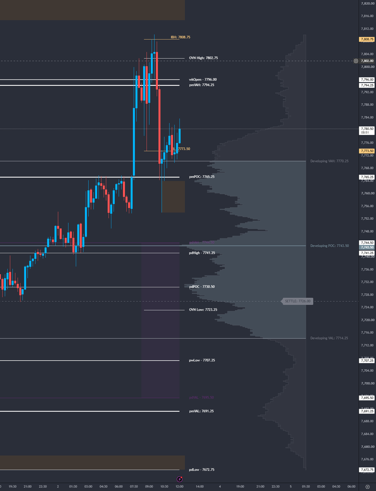

<p align="center"></p>

# Tatanka AMT Toolkit: TradingView Guide

Version 1.0.0 · [Tatanka Trading](https://tatankatrading.com) · Free and open source (MPL 2.0)

The Tatanka AMT Toolkit puts a complete Auction Market Theory read on one chart. On TradingView it's a free, public, open-source script that runs on the free TradingView plan.

<p align="center"></p>

## Contents

1. [Add it to your chart](#1-add-it-to-your-chart)
2. [Set up the chart](#2-set-up-the-chart)
3. [What you see on the chart](#3-what-you-see-on-the-chart)
4. [Daily levels](#4-daily-levels)
5. [Alerts](#5-alerts)
6. [Settings map](#6-settings-map)
7. [Updates](#7-updates)
8. [Troubleshooting](#troubleshooting)
9. [The other free Tatanka indicators](#9-the-other-free-tatanka-indicators)

## 1. Add it to your chart

1. Open the [Tatanka AMT Toolkit script page](https://tatankatrading.com/tv/amt-toolkit).
2. Click **Add to favorites**.
3. On your chart, open **Indicators** (or press `/`), go to **Favorites**, and click **Tatanka AMT Toolkit: Auction Market Structure**.

On the chart it's labeled **Tatanka AMT**.

## 2. Set up the chart

- **Symbol:** a CME futures symbol such as ES1!, NQ1!, CL1! or GC1! (or their micros). The Toolkit works on other symbols too.
- **Timeframe:** a minute chart, for example 5 or 15 minutes.
- **History:** scroll back far enough for the profile period you use. A yearly profile needs a long history.
- **Time zone:** every session time in the Toolkit is CME exchange time (Central). Leave those inputs at their defaults. To see your local time, change the chart's time zone instead (bottom-right corner of the chart). If a session input is changed, the Toolkit shows a red warning label on the chart.

## 3. What you see on the chart

**Where is value?**
- Developing volume profile for the session, week (default), month or year, with POC, VAH and VAL. Optional high-volume walls.
- Prior-day POC, VAH and VAL (RTH session) and prior-month POC, VAH, VAL, high and low.
- RTH VWAP from the 8:30 CT open (off by default).

**Balanced or trending?**
- Initial Balance (8:30–9:30 CT) with an optional midpoint.
- Day type, updated through the session: Trend Day, Normal Day, Normal Variation, Neutral Day (center or extreme) or Non-Trend Day. Before the auction develops: Gap Up, Gap Down or Developing.
- 80% Rule: when the session opens outside the prior day's value area, the value area is shaded; after price holds inside it for 60 minutes, it's marked confirmed.

**Who is trapped?**
- Overnight inventory versus the prior settlement. When the whole overnight session traded on one side of settlement, the settlement line is marked **TRAP ACTIVE** and the day type shows TRAP.
- Late spike: the base of a breakout in the last 30 minutes of RTH (14:30–15:00 CT).

**What is unfinished?**
- Naked POCs (daily, weekly, monthly), removed once price trades through them.
- Single prints from a 30-minute TPO profile of RTH, with tails filtered out.
- Poor highs and lows: a session extreme with two or more TPO periods at the same price.

**Which reference prices matter?**
- Overnight high and low (removed at 15:00 CT by default), previous day, week and month high and low, the weekly open (Sunday Globex) and the RTH open.

**Dashboard** (top right by default): session, day type, pivot bias (price versus your pasted pivot), overnight inventory, open location, daily ATR and ATR used, and 80% Rule status. The header shows **Tatanka AMT** and the version.

## 4. Daily levels

1. Double-click the Toolkit on the chart (or click its gear icon) to open the settings.
2. Under **2. Daily Levels**, paste into **Paste Levels Here**:

```
2026-10-05, 7745.25, 7758.25, 7772.00, 7786.50, 7801.25, 7818.00, 7730.25, 7718.25, 7707.25, 7690.50, 7672.75
```

3. Click **OK**.

The line is the date, the pivot, then any prices. Prices above the pivot are drawn as resistance (R1 nearest) and prices below it as support (S1 nearest). The three-line block (`Pivot Level:` / `Resistance Levels:` / `Support Levels:`) also works; if both are pasted, the one-line version wins. Write prices without thousands separators.

Each level gets a zone (sized by daily ATR or by ticks) and flips color once price passes through it by the Flip ATR Buffer.

Tatanka Trading's daily ML levels for ES, NQ, CL and GC come in exactly this one-line format with the $20/month Patreon, together with the Globex levels after the close and the afternoon review plans. See [tatankatrading.com](https://tatankatrading.com).

## 5. Alerts

1. Turn on the alerts you want in the Toolkit's settings (each section has its own alert switches; level alerts are under **2. Daily Levels → Enable Level Alerts**).
2. Open **Create Alert** (`Alt + A`).
3. **Condition:** Tatanka AMT, then **Any alert() function call**.
4. Pick how you want to be notified and click **Create**.

One TradingView alert covers every alert you switched on in the Toolkit. An alert storm cap limits how many fire in a rolling window (30 per 60 minutes by default).

**Important:** a TradingView alert keeps the settings, including the pasted levels, from the moment you created it. After pasting new levels, delete the alert and create it again. Every other Toolkit alert updates on its own.

The free TradingView plan limits how many alerts you can have active at once.

## 6. Settings map

| Group | What's in it |
| --- | --- |
| 1. Global Settings | Profile Row Scale, tick size, Force on Top, hide all labels, price-axis tags, session-time warning |
| 2. Daily Levels | Paste box, lines, zones, labels, level alerts |
| 3. Previous Day High/Low/Open | pdHigh, pdLow, pdOpen |
| 4. Previous Day Value & 80% Rule | pdPOC, pdVAH, pdVAL, 80% Rule fill and alerts |
| 5. Overnight High/Low | OVN session, removal time, alerts |
| 6. Initial Balance | IB period, midpoint, extension, alerts |
| 7. RTH VWAP | Start/end time, style, alert |
| 8. Daily & Weekly Open | RTH open, weekly open |
| 9. Previous Week | pwHigh, pwLow |
| 10. Previous Month | pmVAH, pmVAL, pmPOC, pmHigh, pmLow |
| 11. Volume Profile | Period, row size, value area %, look, alerts |
| 12. Volume Profile Walls | High-volume walls |
| 13. TPO & Single Prints | TPO period, single prints, poor highs/lows |
| 14. Naked POCs | Daily, weekly, monthly nPOCs |
| 15. Settlement & Inventory | Settlement line, trap logic |
| 16. Late Spike | Spike window and base |
| 17. Dashboard | Position, size, ATR period |
| 18. Alerts | Alert storm cap |

**Profile Row Scale** (Global Settings) is set to *Auto*: it sizes profile rows, naked POC bins and single-print blocks to the symbol's price, so NQ gets larger rows than ES without a separate mode. Pick a fixed scale (1x–100x) if a symbol loads slowly.

## 7. Updates

TradingView delivers updates to published scripts; there's nothing to download. The version shows in the dashboard header. If it still shows the old version after reloading the page, remove the Toolkit from the chart and add it again from Favorites.

## Troubleshooting

| Problem | Fix |
| --- | --- |
| Script times out or loads slowly | Set **Profile Row Scale** higher (for example 10x), or pick a shorter profile period. |
| Red warning about session times | A session input was changed. Reset it to the default (right-click the input or use **Defaults → Reset settings**). Use the chart's time zone for local time instead. |
| Levels don't draw | Check the line format: date first, then prices, comma-separated, no thousands separators. |
| Older lines or labels disappear | TradingView allows 500 lines, 500 boxes and 500 labels per script and removes the oldest first. Turn off sections you don't use. |
| Profiles look shifted around a contract roll | On continuous symbols (ES1!), profiles switch to the new front contract once it out-trades the old one. During a roll week, TradingView's continuous symbol can still follow the expiring contract. |
| Level alerts fire on yesterday's levels | Delete the alert and create it again after pasting new levels. |
| "Too many indicators" | The free plan limits how many indicators fit on one chart. Remove one, or use a second chart. |

## 9. The other free Tatanka indicators

Also free and open source on TradingView and NinjaTrader:

- [TPO Profile](https://tatankatrading.com/tv/tpo)
- [If/Then](https://tatankatrading.com/tv/ifthen): paste the afternoon review's if/then block and it shows the bias for the zone price is in.
- [1hr 21 EMA](https://tatankatrading.com/tv/21ema)

Setup for all three is in the [other indicators guide](Other-Indicators-Guide.md).

All of them are listed at [tatankatrading.com/indicators](https://tatankatrading.com/indicators/).

## License

Open source under the [Mozilla Public License 2.0](../LICENSE). Copyright (c) 2026 Tatanka Trading LLC.

*Trading futures involves substantial risk of loss. The Toolkit is an analysis tool. It gives no buy/sell signals and no trade recommendations.*
